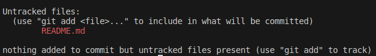
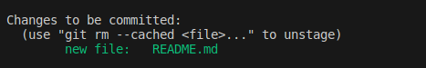
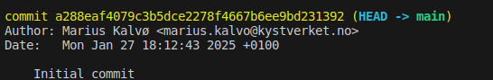
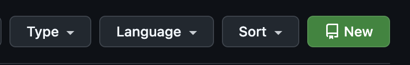
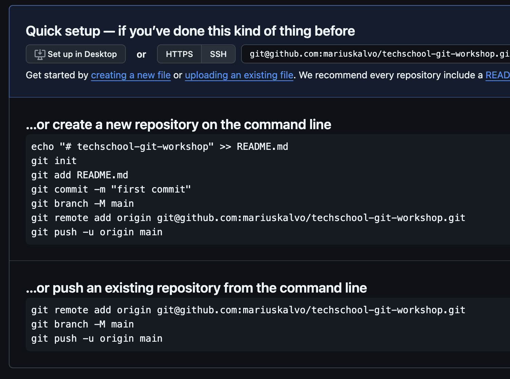

# Oppgave 1 - Vanlige kommandoer

## Mål med Oppgave 1

Etter denne oppgaven skal du kunne:

- Konfigurere Git på egen maskin
- Lære noen av de mest brukte kommandoene i CLIen:
  - `git init` (Initialisere et lokalt Git-repository)
  - `git add` (Legge til filer i staging-området)
  - `git commit` (Committe filer til lokalt repository)
  - `git push` (Pushe commits fra lokalt repository til remote repository på GitHub)
  - `git pull` (Hente commits fra remote repository)

## 1.1 - Oppsett av Git-config

I denne seksjonen skal vi sette opp konfigurasjon som beskriver "hvem du er" i Git. Du kan hoppe over denne delen om du allerede har gjort dette tidligere. Om `git config --global user.name` og `git config --global user.email` returnerer ditt navn og epost-adresse, er alt satt opp og du kan gå videre til neste seksjon.

:pencil2: Konfigurer navn og epost i Git-konfigurasjonen din

```bash
git config --global user.name "Ditt Navn"
git config --global user.email ditt.navn@epost.no
```

Erstatt `Ditt Navn` og `ditt.navn@epost.no` med ditt eget navn og epostadresse.

## 1.2 - Oppsett av standard editor

I enkelte tilfeller trenger du en editor når du bruker Git via CLI, eksempelvis når du skal godta en merge eller skrive om commits. Avhengig av hvilket operativsystem du bruker, kan standardvalget være satt til Notepad, Vim eller nano. Ønsker du å bruke en annen editor, kan du konfigurere dette.

:pencil2: Konfigurer standard editor *(Valgfritt. Om du ikke vil konfigurere standard editor for Git (dvs. du er fornøyd med den du alt bruker, f.eks. Vim eller nano), kan du hoppe over dette steget.)*

For å konfigurere Git til å bruke Visual Studio Code som standard editor, kan du føre inn følgende kommando i terminalen din:

```bash
git config --global core.editor "code --wait"
```

## 1.3 - Opprett Git repository

:pencil2: Opprett en ny tom katalog/mappe på maskinen din. (F.eks. `git-workshop-files`). Sørg for at du står i denne katalogen i terminalen din.

:pencil2: Initialiser et Git repository. Dette gjør du med kommandoen `git init`.
Du vil se terminalen svare tilbake:

```text
Initialized empty Git repository in /[sti til katalog]/git-workshop-files/.git/
```

## 1.4 - Første Git commit

:pencil2: Legg til en fil som heter `README.md` og legg en passende tekst i filen (Eksempel: `"Techschool Git workshop"`).

:pencil2: Sjekk status på filen med kommandoen `git status`. Her bør du se filen du la til under `Untracked files`. Dette betyr at filen ligger i filsystemet, men at den ikke ennå er lagt til i "staging area".

<div style="text-align: center; margin-top: 2rem; margin-bottom: 2rem;">
  
</div>

:pencil2: Legg til filen i staging area. Dette kan du gjøre med kommandoen `git add README.md`. Sjekk status på nytt med kommandoen `git status`.

<div style="text-align: center; margin-top: 2rem; margin-bottom: 2rem;">
  
</div>

:pencil2: Opprett en commit som inkluderer filen du har laget med kommandoen `git commit -m "<melding>"` og skriv en passende commit-melding (`Initial commit` er ofte en passende melding for første commit i et repository).

:pencil2: Sjekk at du har en commit i commit-loggen din ved å bruke kommando `git log`.

<div style="text-align: center; margin-top: 2rem; margin-bottom: 2rem;">
  
</div>

Du har nå opprettet et Git-repository og lagt inn første commit via kommandolinjen. Bra jobba! Nå har vi alt arbeid lokalt på egen maskin, men vi ønsker gjerne å sjekke inn koden et sentralt sted.

## 1.5 - Opprett GitHub-repository

:pencil2: Opprett et GitHub-repository på github.com. Har du ikke en GitHub-konto, må du først opprette en. Gå inn på din profil og velg fanen `Repositories`. Her vil du finne en stor grønn knapp med tittel "New"

<div style="text-align: center; margin-top: 2rem; margin-bottom: 2rem;">
  
</div>

Velg et passende navn under **`Repository name`** (Forslag: `techschool-git-workshop`). Ikke velg noen andre innstillinger, og trykk **`Create repository`**.

Du vil komme til følgende skjermbilde, og du skal benytte deg av de nederste instruksene (**`push an existing repository from the command line`**)

<div style="text-align: center; margin-top: 2rem; margin-bottom: 2rem;">
  
</div>

Etter du har utført instruksene i GitHub, vil du ha:

- Satt opp ditt lokale repository til å spore et "remote repository" / en "remote origin"
- En Git branch ved navn `main` (Om du sto på branch `master` blir denne nå `main` som er standard branch-navn på GitHub)
- Pushet endringene dine til remote origin

:pencil2: For å simulere en endring utenfor egen maskin, trykk på blyant-ikonet på [GitHub](https://github.com), og endre en fil. Når den er lagret kan du skrive `git pull` i terminalen din for å hente ned siste endringer.

---

[:arrow_right: Gå til neste oppgave](../oppgave-2/README.md)
