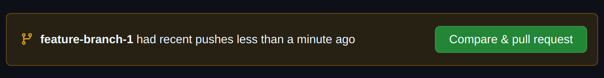
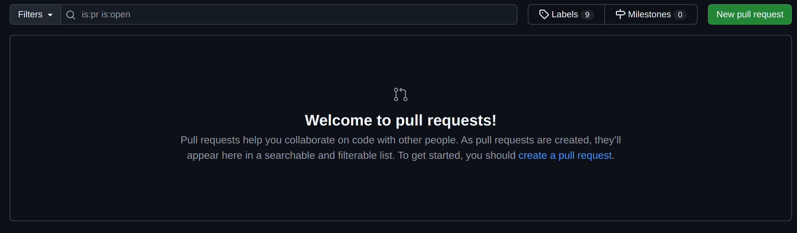
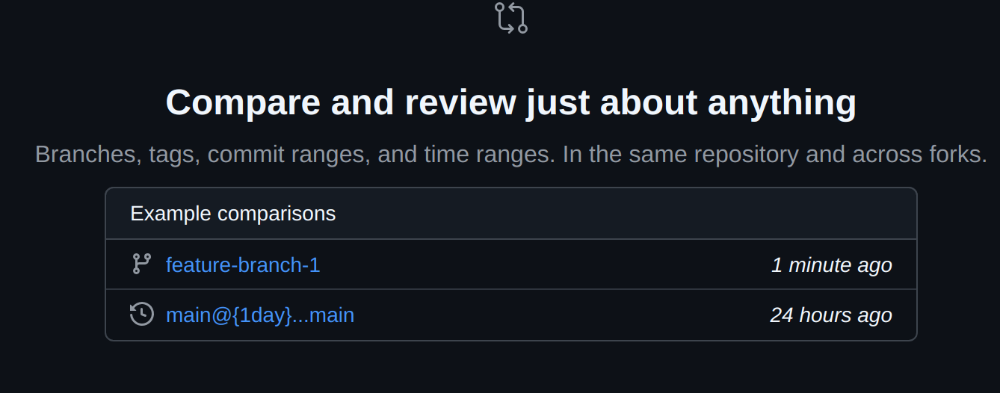
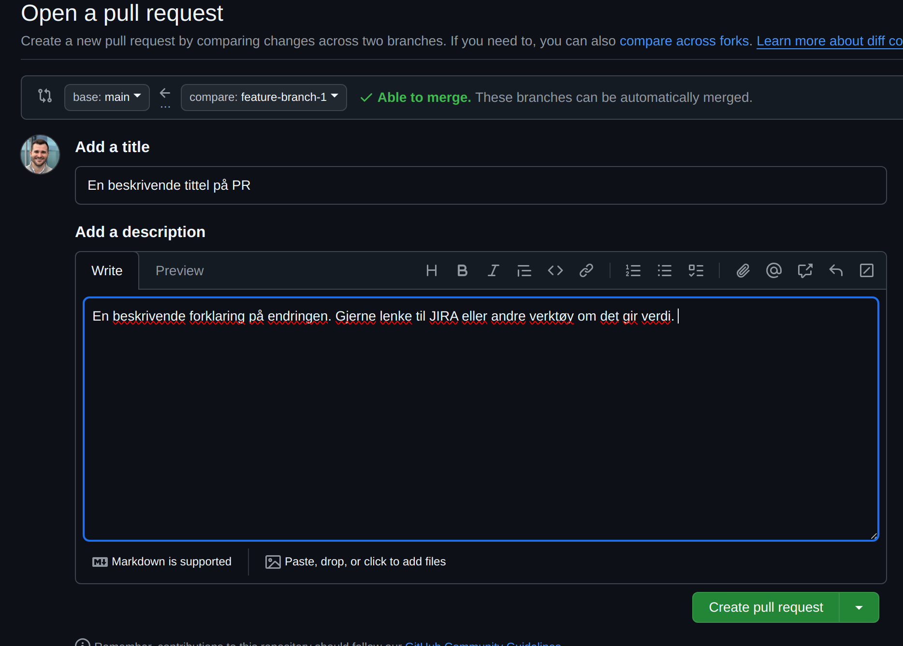

# Oppave 3 - Bruk av Github

## Mål med Oppgave 3

Når en arbeider på systemer som må fungere til enhver tid, er pull requests og code reviews et viktig verktøy. Ved å lage en pull request, får en å beskrive endringer, og dine kollegaer kan være med å diskutere og komme med forbedringsforslag. I tillegg fungerer det som en god mekanisme for dokumentasjon for hvorfor en endring er utført.

Dette er en fri oppgave. Målet er at du bruker tid til å bli kjent med hvordan en oppretter pull requests (PR), skriver kommentarer og foretar en pull request review.

### 3.1 Opprette pull request

:pencil2: Sjekk ut en ny branch med et navn du velger selv. Opprett en ny fil med noe innhold, og sjekk denne inn med en commit i branchen.

Når du forsøker å pushe en branch for første gang til remote repository, vil første gang få en feilmelding om at den ikke har en "upstream branch". Her forteller Git deg hva du må gjøre for at branchen din skal spores i remote repository 
```
git push --set-upstream origin <branchnavn>
```

:pencil2: Push branch til remote repository.

Det er flere snarveier for å komme inn i grensesnittet for å opprette pull request. Når du pusher endring git remote repository, får du opp i terminalen din en lenke du kan gå til for å opprette PR. Alternativt, dersom du nylig har pushet til en branch, vil du få en pop-up om å opprette en pull request fra den branchen. 

<div style="text-align: center; margin-top: 2rem; margin-bottom: 2rem;">
  
</div>

Dersom du ikke har pushet nylig til en branch, kan du opprette en pull request via "New pull request" på høyre side av skjermbildet.

<div style="text-align: center; margin-top: 2rem; margin-bottom: 2rem;">
  
</div>

Du vil da kunne velge hvilken branch du vil opprette PR for. Eksempel her, kan jeg velge `feature-branch-1`.

<div style="text-align: center; margin-top: 2rem; margin-bottom: 2rem;">
  
</div>

Du vil få opp ett skjema for å opprette PR. Her kan du beskrive hvilke konkrete endringer som er utført. Dette er nyttig både for å gi vedkommende som skal kjøre review nødvendig info, men gir oss også mulighet til å gå tilbake å se under hvilke omstendigheter denne endringen ble innført.

<div style="text-align: center; margin-top: 2rem; margin-bottom: 2rem;">
  
</div>

:pencil2: Opprett en pull request i github.

:pencil2: Start en pull request review på egen PR. Prøv å legg til en kommentar for endringen, tilknyttet en konkret kodelinje. Godkjenn eller avvis PR'en. Du kan starte en review ved å gå til fanen `Files changed`, og deretter skrive en kommentar ved å trykke på en `+`-ikonet ved en kodelinjenummeret på en endring. Du kan fullføre review ved å trykke på `Review changes` i øvre høyre hjørne. Du får som regel ikke lov til godkjenne eller avvise egen PR, men det får du om du reviewer en PR som noen andre har laget. Klikk deg rundt og gjør det kjent med grensesnittet. 

:pencil2: Merge pull request inn i `main`. Dette gjør du i `Conversations`-fanen.

Det er lurt å slette branch etter en har merget den inn i `main`. Da slipper man rot i remote repository. Etter du har merget en pull request, får du opp en knapp for dette.

---

[:arrow_right: Gå til neste oppgave](../oppgave-4/README.md)
