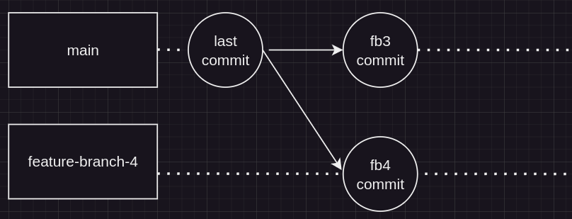
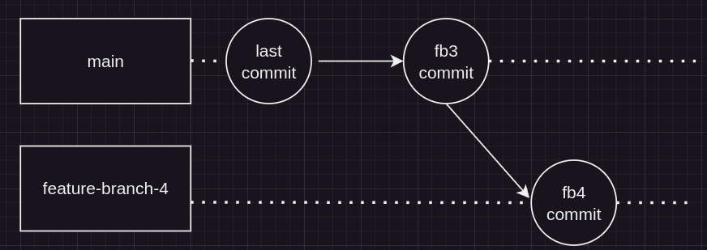

# Oppgave 4 - Rebasing

## :bulb: Mål med Oppgave 4

Etter denne oppgaven skal du kunne å:

- Bruke `git rebase` for å flette endringer
- Bruke `git rebase` i interaktiv-modus
- Bruke `git pull --rebase` for å bruke rebase når du drar ned endringer

### 4.1 - Git rebase
:bulb: Git rebase er en måte å skrive om historikken, slik vi kan flytte commits fra en branch til toppen av en annen branch, slik historikken blir lineær. Vi skriver om historikken, slik at endringene våre tilsynelatende ser ut til å ta utgangspunkt i den nyeste versjonen av branchen vi rebaser mot. 

Vi skal nå sette oss i en situasjon lik før, der vi har behov for å merge endringer. I stedet for å bruke `git merge`, skal vi bruke `git rebase` for å rebase den andre branchen vi vil merge inn for å unngå konflikter. I dette tilfellet skal vi ikke merge begge brancher direkte mot `main`, men merge 1 branch først, og deretter rebase branchen mot `main`, for å først "skrive inn" endringene i feature-branch 2 og dermed unngå konflikter.

:pencil2: Sjekk ut en feature-branch, `feature-branch-5`, fra `main` branch. Erstatt innholdet i `index.ts` med innholdet i `code/4.1-endring-1.ts`. Sjekk endringene inn i en commit i branchen din.

:pencil2: Sjekk ut `main` branch, og ut i fra `main` branch, opprett en ny branch, `feature-branch-6`. Erstatt innholdet i `index.ts` med innholdet i `code/4.1-endring-2.ts`.

:pencil2: Merge `feature-branch-5` inn i `main`.

:pencil2: Gå inn i `feature-branch-5`. Rebase endringene fra `main` inn i `feature-branch-5`. Dette kan du gjøre med følgende kommando:

```
git rebase main
```



:bulb: Du ønsker som regel aldri å rebase en branch inn i main. Da skriver du om historikken i felles arbeidsbranch. Dette gjøres som regel ved spesielle tilfeller, der du har et konkret behov for å skrive om historikk, eksempelvis om du det ligger informasjon i `main` som må fjernes. 

### Git rebase interactive

Når du står i en feature-branch, vil du i noen tilfeller skrive om commits du har sjekket inn, f.eks. ved å slå sammen commits eller endre commit-melding for en commit. Dette kan du gjøre med `git rebase` i interaktiv modus.

Vi skal bruke interactive rebase for å slå sammen commits

:pencil2: Sjekk ut en branch. Opprett en fil, eller gjør endringer i en eksisterende fil. Opprett så en commit. Gjenta dette 3 ganger til, til du har 4 commits i branchen din. 

:pencil2: Push branchen din til remote repository

:pencil2: Bruk `git rebase` i interaktiv modus for å slå sammen commits. 

:pencil2: Etter du har slått sammen commits, prøv å push endringen til remote repository. Du får få opp at endringen ikke godtas. Dette er fordi vi har skrevet om historikken.

:penvil2: Push til branch ved å bruke kommandoen `git push --force-with-lease`.

:bulb: Når du har skrevet om historikken på en branch som spores i et remote repository, må du pushe endring med et force-flagg for at endringen skal godtas. Det er fristende å bruke `git push -f` (eller `--force`) som tvinger endringen inn. Dette er OK når en arbeider alene. Når en arbeider i team, kan en risikere å skrive om andre sitt arbeid. Det er lurt å bruke kommandoen `git push --force-with-lease` istedet for, da denne tvingen inn endringen kun dersom ingen andre har utført noen endringer siden sist du hentet ned branchen. 


### Git pull --rebase

---

[:arrow_right: Gå til neste oppgave](../oppgave-5/README.md)
