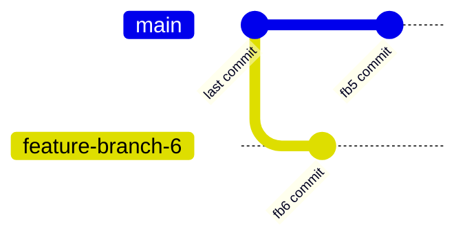
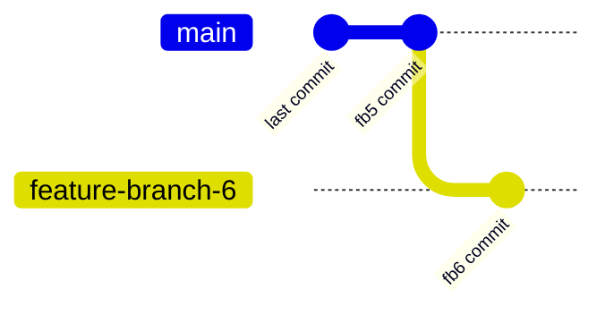
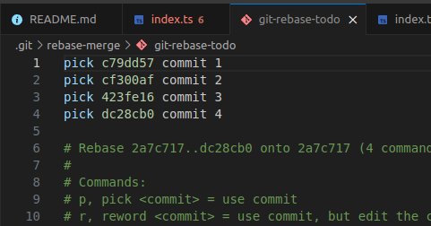

# Oppgave 4 - Rebasing

## Mål med Oppgave 4

Etter denne oppgaven skal du kunne å:

- Bruke `git rebase` for å flette endringer
- Bruke `git rebase` i interaktiv-modus
- Bruke `git pull --rebase` for å bruke rebase når du drar ned endringer

## 4.1 - Git rebase

Git rebase er en måte å skrive om historikken, slik vi kan flytte commits fra en branch til toppen av en annen branch, slik historikken blir lineær. Vi skriver om historikken, slik at endringene våre tilsynelatende ser ut til å ta utgangspunkt i den nyeste versjonen av branchen vi rebaser mot. 

Vi skal nå sette oss i en situasjon lik før, der vi har behov for å merge endringer. I stedet for å bruke `git merge`, skal vi bruke `git rebase` for å rebase den andre branchen vi vil merge inn for å unngå konflikter i `main`. I dette tilfellet skal vi ikke merge begge brancher direkte mot `main`, men merge 1 branch først, og deretter rebase den andre branchen mot `main`, for å løse konflikten i feature-branchen og dermed unngå konflikter i `main`.

:pencil2: Sjekk ut din lokale `main` branch, og bruk `git pull` for å hente ned endringer fra forrige oppgave.

:pencil2: Sjekk ut en feature-branch, `feature-branch-5`, fra `main` branch. Erstatt innholdet i `index.ts` med innholdet i `code/4.1-endring-1.ts`. Sjekk endringene inn i en commit i branchen din.

:pencil2: Sjekk ut `main` branch, og ut i fra `main` branch, opprett en ny branch, `feature-branch-6`. Erstatt innholdet i `index.ts` med innholdet i `code/4.1-endring-2.ts`. Sjekk endringene inn i en commit i branchen din.

:pencil2: Sjekk ut `main` og merge `feature-branch-5` inn i `main`. 

Historikken bør se slik ut, med en fast-forward merge fra `feature-branch-5` (`fb5 commit`). 


```mermaid
gitGraph
   commit id: "last commit"
   branch feature-branch-6
   commit id: "fb6 commit"
   checkout main
   commit id: "fb5 commit"
```

Vi skal nå rebase historikken i `feature-branch-6`, slik at det tilsynelatende ser ut som vi har branchet ut fra endringene påført etter merge fra `feature-branch-5`.

:pencil2: Sjekk ut `feature-branch-6`. Rebase `feature-branch-6` på toppen av `main`. Dette kan du gjøre med følgende kommando (merk at du står i `feature-branch-6` og oppgir branchen du vil rebase *mot*):

```
git rebase main
```

:pencil2: Løs konflikten du får opp fra rebase (velg selv hvilken side / hvilke deler av koden du vil beholde). Du kan bruke merge-verktøyet i VS Code på samme måte som i oppgave 2. Merk at under en rebase er `Current` innholdet i `main` (branchen du rebaser mot) og `Incoming` er din commit fra `feature-branch-6`.

:pencil2: Når du har løst konflikten, bruk `git add index.ts` for å stage filen, og bruk `git rebase --continue` for å ferdigstille rebase. Du vil få opp et editor-vindu som du kan lukke for å godta rebase.

Historikken bør nå se slik ut. Vi kan nå enkelt merge inn endringene fra `feature-branch-6`. 


```mermaid
gitGraph
   commit id: "last commit"
   commit id: "fb5 commit"
   branch feature-branch-6
   commit id: "fb6 commit"
```

:pencil2: Sjekk ut `main` og merge endringene fra `feature-branch-6` inn i `main`. Siden vi har "lurt" git til å tro at vi jobbet over endringer vi egentlig hadde konflikt med, vil vi få en fast-forward-merge.

:exclamation: Det vi gjorde nå, å rebase en feature-branch på toppen av `main`, er trygt og vanlig. Det du som regel *aldri* skal gjøre, er å rebase `main` (eller andre brancher som flere jobber i). Da skriver du om historikken i en felles arbeidsbranch, og alle andre som har hentet ned branchen får en historikk som ikke lenger stemmer. Dette gjøres kun i spesielle tilfeller, der du har et konkret behov for å skrive om historikk, eksempelvis om det ligger informasjon i `main` som må fjernes. En fin tommelfingerregel er at en kun skriver om historikk i sin egen branch. Omskriving av historikk kan være en fot-pistol; da er det greit å kun skyte seg selv i foten. 

## 4.2 - Git rebase interactive

Når du står i en feature-branch, vil du i noen tilfeller skrive om commits du har sjekket inn, f.eks. ved å slå sammen commits eller endre commit-melding for en commit. Dette kan du gjøre med `git rebase` i interaktiv modus.

Vi skal bruke interactive rebase for å slå sammen commits. 

:pencil2: I denne oppgaven velger du selv commit-meldinger og innhold i endringer
- Sjekk ut en branch fra `main` branch. Velg selv et navn på branch.
- Opprett en fil, eller gjør endringer i en eksisterende fil.
- Opprett så en commit.
- Gjenta endring i fil og ny commit 3 ganger til, til du har 4 commits i branchen din. 

:pencil2: Push branchen din til remote repository.

:pencil2: Bruk `git rebase` i interaktiv modus for å slå sammen commits. Bruk følgende kommando:
```
git rebase -i main
```
Du vil nå få opp et editor-vindu med commits som har skjedd i branchen din siden du branchet ut fra `main`. I eksempelet under er det 4 commits i en branch: `commit 1`, `commit 2`, `commit 3`, `commit 4`. 

<div style="text-align: center; margin-top: 2rem; margin-bottom: 2rem;">
  
</div>

I de 3 siste radene, kan du erstatte verdien `pick` med verdien `s` eller `squash`. Squash vil slå sammen commiten med commiten over. Som i tilfellet under, vil `commit 4` slås sammen med `commit 3`, som slås sammen med `commit 2`, som slås sammen med `commit 1` (vi beholder `pick` på `commit 1`).

<div style="text-align: center; margin-top: 2rem; margin-bottom: 2rem;">
  
</div>

:pencil2: Lagre og lukk filen. Du vil få opp et nytt editor-vindu. Her kan du skrive ny commit-melding for de sammenslåtte commitene. Fjern innholdet i filen og skriv en passende melding. Lagre og lukk deretter filen du fikk opp.

:pencil2: Prøv å push endringen til remote repository. Du vil få beskjed om at endringen ikke godtas. Dette er fordi vi har skrevet om historikken.

:pencil2: Push til branch ved å bruke kommandoen `git push --force-with-lease`.

Når du har skrevet om historikken på en branch som spores i et remote repository, må du pushe endring med et force-flagg for at endringen skal godtas. Det er fristende å bruke `git push -f` (eller `--force`) som tvinger endringen inn. Dette er OK når en arbeider alene. Når en arbeider i team, kan en risikere å skrive om andre sitt arbeid. Det er lurt å bruke kommandoen `git push --force-with-lease` istedet for, da denne tvinger inn endringen kun dersom ingen andre har utført noen endringer siden sist du hentet ned branchen. 

## 4.3 - Git pull med rebase

Når både du og remote repository har nye commits i samme branch, sier vi at historikken har *divergert*. Når du da kjører `git pull`, må git vite om den skal merge eller rebase for å sy sammen historikken. Nyere versjoner av git nekter å gjette, og gir deg en feilmelding. Eldre versjoner lager en merge-commit uten å spørre.

:pencil2: Sjekk ut `main` og sørg for at den er oppdatert mot Github (`git pull`).

:pencil2: Gjør en endring i `README.md` på github.com via blyant-ikonet, slik som i oppgave 1.5. Da får `main` på Github en ny commit som du ikke har lokalt.

:pencil2: Gjør en annen endring lokalt i `main` (f.eks. i `index.ts`), og lag en commit. Ikke kjør `git pull` først.

:pencil2: Kjør `git pull`. Du vil få en feilmelding lik denne:

```
hint: You have divergent branches and need to specify how to reconcile them.
...
fatal: Need to specify how to reconcile divergent branches.
```

:pencil2: Kjør `git pull --rebase`. Din lokale commit legges nå på toppen av commiten fra Github, og historikken forblir lineær. Sjekk med `git log --oneline --graph`.

:pencil2: Push endringene til Github.

:bulb: Om du alltid ønsker rebase når du puller, kan du sette dette som standard med `git config --global pull.rebase true`.

---

[:arrow_right: Gå til neste oppgave](../oppgave-5/README.md)
