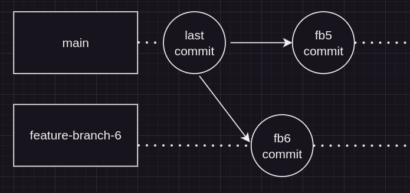
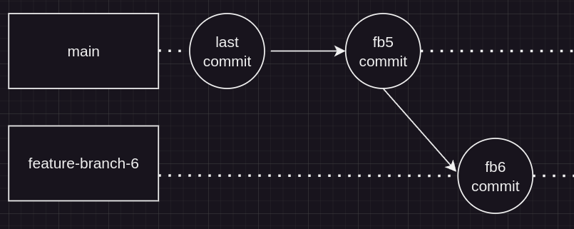

# Oppgave 4 - Rebasing

## :bulb: Mål med Oppgave 4

Etter denne oppgaven skal du kunne å:

- Bruke `git rebase` for å flette endringer
- Bruke `git rebase` i interaktiv-modus
- Bruke `git pull --rebase` for å bruke rebase når du drar ned endringer

### 4.1 - Git rebase

:bulb: Git rebase er en måte å skrive om historikken, slik vi kan flytte commits fra en branch til toppen av en annen branch, slik historikken blir lineær. Vi skriver om historikken, slik at endringene våre tilsynelatende ser ut til å ta utgangspunkt i den nyeste versjonen av branchen vi rebaser mot. 

Vi skal nå sette oss i en situasjon lik før, der vi har behov for å merge endringer. I stedet for å bruke `git merge`, skal vi bruke `git rebase` for å rebase den andre branchen vi vil merge inn for å unngå konflikter. I dette tilfellet skal vi ikke merge begge brancher direkte mot `main`, men merge 1 branch først, og deretter rebase branchen mot `main`, for å først "skrive inn" endringene i feature-branch 2 og dermed unngå konflikter.

:pencil2: Sjekk ut en feature-branch, `feature-branch-5`, fra `main` branch. Erstatt innholdet i `index.ts` med innholdet i `code/4.1-endring-1.ts`. Sjekk endringene inn i en commit i branchen din.

:pencil2: Sjekk ut `main` branch, og ut i fra `main` branch, opprett en ny branch, `feature-branch-6`. Erstatt innholdet i `index.ts` med innholdet i `code/4.1-endring-2.ts`.

:pencil2: Merge `feature-branch-5` inn i `main`.

Historikken bør se slik ut, med en fast-forward merge fra `feature-branch-5` (`fb4 commit`). 

<div style="text-align: center; margin-top: 2rem; margin-bottom: 2rem;">
  
</div>

Vi skal nå rebase historikken i `feature-branch-6`, slik at det tilsynelatende ser ut som vi har branchet ut fra endringene påført etter merge fra `feature-branch-5`.

:pencil2: Gå inn i `feature-branch-5`. Rebase endringene fra `main` inn i `feature-branch-5`. Dette kan du gjøre med følgende kommando:

```
git rebase main
```

:pencil2: Løs konflikten du får opp fra rebase (velg selv hvilken side / hvilke deler av koden du vil beholde). 

:pencil2: Når du er ferdig med å rebase, bruk `git add .` for å stage fil, og bruk `git rebase --continue` for å ferdigstille rebase. 

Historikken bør nå se slik ut. Vi kan nå enkelt merge inn endringene fra `feature-branch-6`. 

<div style="text-align: center; margin-top: 2rem; margin-bottom: 2rem;">
  
</div>

:pencil2: Merge endringene fra `feature-branch-6` inn i main.

:bulb: Du ønsker som regel aldri å rebase en branch inn i main. Da skriver du om historikken i felles arbeidsbranch. Dette gjøres som regel ved spesielle tilfeller, der du har et konkret behov for å skrive om historikk, eksempelvis om du det ligger informasjon i `main` som må fjernes. 

### Git rebase interactive

Når du står i en feature-branch, vil du i noen tilfeller skrive om commits du har sjekket inn, f.eks. ved å slå sammen commits eller endre commit-melding for en commit. Dette kan du gjøre med `git rebase` i interaktiv modus.

Vi skal bruke interactive rebase for å slå sammen commits. 

:pencil2: I denne oppgaven gjør velger du selv commit-meldinger og innhold i endringer
- Sjekk ut en branch. Velg et navn.
- Opprett en fil, eller gjør endringer i en eksisterende fil.
- Opprett så en commit.
- Gjenta dette endring i fil og ny commit 3 ganger til, til du har 4 commits i branchen din. 

:pencil2: Push branchen din til remote repository.

:pencil2: Bruk `git rebase` i interaktiv modus for å slå sammen commits. Bruk følgende kommando:
```
git rebase -i main
```
Du vil nå få opp et editor-vindu med commits som har skjedd i branchen din siden du branchet ut fra `main`. I eksempelet under er det 4 commits i en branch `commit 1`, `commit 2`, `commit 3`, `commit 4`. 


I de 3 siste radene, kan du erstatte verdien `pick` med verdien `s`eller `squash`. Squash vil slå sammen commiten med commiten over. Som i tilfelle under, vil `commit 4`, slås sammen med `commit 3`, som slår sammen med `commit 2` som slås sammen med `commit 1` (vi beholder `pick` på `commit 1`).


:pencil2: Lagre og lukk filen. Du fil få opp et nytt editor-vindu. Her kan du skrive ny commit-melding for de sammenslåtte commitene. Fjern innholdet i filen og skriv en passende melding. Lagre og lukk deretter filen du fikk opp.

:pencil2: Prøv å push endringen til remote repository. Du får få opp at endringen ikke godtas. Dette er fordi vi har skrevet om historikken.

:penvil2: Push til branch ved å bruke kommandoen `git push --force-with-lease`.

:bulb: Når du har skrevet om historikken på en branch som spores i et remote repository, må du pushe endring med et force-flagg for at endringen skal godtas. Det er fristende å bruke `git push -f` (eller `--force`) som tvinger endringen inn. Dette er OK når en arbeider alene. Når en arbeider i team, kan en risikere å skrive om andre sitt arbeid. Det er lurt å bruke kommandoen `git push --force-with-lease` istedet for, da denne tvingen inn endringen kun dersom ingen andre har utført noen endringer siden sist du hentet ned branchen. 


---

[:arrow_right: Gå til neste oppgave](../oppgave-5/README.md)
