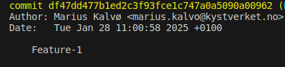
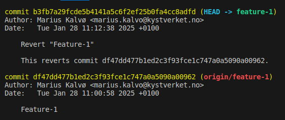

# Oppgave 5 - Bonusoppgave: Praktiske tips og verktøy

## :bulb: Mål med Oppgave 5

I denne oppgaven skal vi se på litt diverse funksjonalitet i git, uten at det følger en tråd. Her er du litt mer på egen hånd; sjekk dokumentasjonen, og lær gjerne kommandoene her utover det som er beskrevet i oppgavene. 

### 5.1 - Sletting av lokale brancher

:bulb: Det kan fort hope seg opp med brancher. Det er vanlig å slette disse eksempelvis når en merger en pull request, men lokale brancher kan bli liggende. Brancher kan slettes lokalt ved å bruke kommandoen `git branch -D <branchnavn>`, der du erstatter `<branchnavn>` med navn på branch du vil slette.

:pencil2: Rydd i feature branches lokalt. Sjekk alle brancher du har med kommando `git branch`, og slett deretter alle brancher utenom `main`.

:star: Bonus: Sjekk i dokumentasjonen forskjellen på `-d` og `-D`-flagg når du sletter branch.

### 5.2 - Du vil ta vare på endringene dine uten å lage en commit (git stash)

Du kan bruke `git stash` for å midlertidig lagre endringer i en branch uten å commite de. Eksempelvis, om du holder på med noe i en branch, men trenger å bytte til en annen branch raskt, kan du stashe endringene dine. Sjekk dokumentasjon for `git stash` her: https://git-scm.com/docs/git-stash

:pencil2: Gjør en endring i `index.ts`. Sjekk at endringen er registrert ved å bruke `git status`. Stash endringene dine med kommando `git stash`. Om du sjekker `git status` på ny, vil ikke endringene dine lengre vise. 

- For å se hvilke innslag du har i stashet, kan du skrive `git stash list`. 
- For å plukke ut igjen siste endring du har stashet, kan du bruke kommando `git stash pop`

:bulb: For å stashe filer som ikke er sporet i repositoriet enda, kan du legge til `-u` flagg på kommandoen. 

:pencil2: Sjekk dokumentasjonen lenket over; finn ut hvordan du kan lagre filer i stashet ditt med en melding. 

:pencil2: Sjekk dokumentasjonen, og finn ut hvordan du kan applisere siste innslag i stashet inn i en ny branch. 

### 5.3 - Sjekke ut tidligere commit

:bulb: Av og til trenger vi å gå tilbake i tid (eksempelvis, om en har en feil i produksjon og trenger å finne ut når denne har inntruffet, eller at har et behov for å se hvordan koden så ut en gang i fortiden).

For å sjekke ut en tidligere commit, kan du bruke kommando `git checkout <sha>`, der du erstatter `<sha>` med commit-hashen til en tidligere commit. Når du sjekker ut en commit, står du i "Detached HEAD state", dvs, du har spolt deg tilbake i tid. Du kan eksempelvis se hvordan tilstanden til koden så ut her eller sjekke ut en branch fra dette punktet. For å hoppe tilbake til toppen av historikken (HEAD), kan du hoppe tilbake ved bruk av `git checkout -` eller `git checkout <branchnavn>`. 

:pencil2: Sjekk ut en tidligere commit. Hopp deretter tilbake til HEAD.

### 5.4 - Du vil flytte en commit fra en branch til en annen

`git cherry-pick` er en nyttig kommando om du ønsker å flytte en commit fra en branch til en annen (uten merge e.l.). `git cherry-pick` vil prøve å applisere commiten direkte som en egen isolert commit i branchen du står på. 

:pencil2: Sjekk ut 2 brancher. Legg inn 2 individuelle commits i begge branches. Hent en commit fra den ene branchen inn i den andre. 

:bulb: cherry-picking er nyttig når du kun trenger deler av koden fra en annen branch, som gjerne er isolert i en commit. Overbruk av cherry-picking kan føre til dupliserte commits i historikken.

### 5.5 - Revertering av endring

Av og til går ting skeis, og vi trenger å revertere en endring i repositoriet vårt. Eksempelvis, om en commit har blitt merget som fører til feil i produksjon. 

For å revertere en commit, kan du bruke kommando `git revert <sha>`, der `<sha>` er sha-hashen til en commit. Sha-hashen finner du i historikken din ved å bruke `git log`. 

Under vises siste commit fra `git log`. Skulel jeg ønske å revertere denne, kan jeg bruke kommando `git revert df47dd477b1ed2c3f93fce1c747a0a5090a00962`. Det vil da opprettes en egen revert-commit som reverserer endringene. 

  

Når du reverserer, vil du få opp et editor-vindu der du kan beskrive revert-commiten. Som regel holder det å lagre og lukke denne filen, da standard melding ofte er god nok. Når siste commit er reversert, ser historikken slik ut

  

:pencil2: Sjekk ut en branch. Gjør en endring og opprett en commit. Reverser så denne commiten.

### 5.6 - Nyttige kommandoer

Du er nå ved veis ende. Veldig bra jobba!! 

#### :star: Bonusoppgave

https://dangitgit.com og https://ohshitgit.com inneholder noen kommandoer som er nyttige å kunne. De lister opp noen konkrete feilscenarioer som kan slå ut når man bruker git, og hvordan en kan bruke CLI-verktøyet til å løse problemene som er listet opp. 

:pencil2: Gå over noen av scenarioene. Prøv å sett deg inn i en feilsituasjon, f.eks. med å commite til feil branch eller å bruke reflog. Kombiner med å slå opp i dokumentasjonen. 
