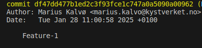
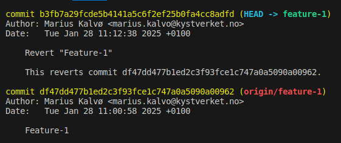

# Oppgave 5 - Bonusoppgave: Praktiske tips og verktøy

## Mål med Oppgave 5

I denne oppgaven skal vi se på litt diverse funksjonalitet i Git, uten at det følger en tråd. Her jobber du litt mer på egen hånd; sjekk dokumentasjonen, og lær gjerne kommandoene her utover det som er beskrevet i oppgavene.

## 5.1 - Sletting av lokale brancher

Det kan fort hope seg opp med brancher. Det er vanlig å slette disse eksempelvis når en merger en pull request, men lokale brancher kan bli liggende. Brancher kan slettes lokalt ved å bruke kommandoen `git branch -D <branchnavn>`, der du erstatter `<branchnavn>` med navn på branch du vil slette.

:pencil2: Rydd i feature branches lokalt. Sjekk alle brancher du har med kommando `git branch`, og slett deretter alle brancher utenom `main`.

:pencil2: Bonus: Sjekk i dokumentasjonen hva forskjellen på `-d` og `-D`-flagg er når du sletter branch.

## 5.2 - Du vil ta vare på endringene dine uten å lage en commit (git stash)

Du kan bruke `git stash` for å midlertidig lagre endringer i en branch uten å commite de. Eksempelvis, om du holder på med noe i en branch, men trenger å bytte til en annen branch raskt, kan du stashe endringene dine. Sjekk dokumentasjon for `git stash` her: <https://git-scm.com/docs/git-stash>

:pencil2: Gjør en endring i `index.ts`. Sjekk at endringen er registrert ved å bruke `git status`. Stash endringene dine med kommando `git stash`. Om du sjekker `git status` på ny, vil ikke endringene dine lenger vises.

- For å se hva du har liggende i stashet, kan du skrive `git stash list`.
- For å plukke ut igjen siste endring du har stashet, kan du bruke kommando `git stash pop`

For å stashe filer som ikke er sporet i repositoriet enda, kan du legge til `-u` flagg på kommandoen.

:pencil2: Sjekk dokumentasjonen lenket over; finn ut hvordan du kan lagre filer i stashet ditt med en melding.

:pencil2: Sjekk dokumentasjonen, og finn ut hvordan du kan applisere siste innslag i stashet inn i en ny branch.

## 5.3 - Holde arbeidsområdene dine adskilt med Git worktree

En annen måte å hoppe mellom branches uten å først måtte committe eller stashe endringene dine er å bruke `git worktree`. Denne kommandoen lar deg ha flere arbeidsområder i samme repository, og du kan dermed jobbe med forskjellige versjoner av koden samtidig.

Se for deg at du sitter i din egen branch og jobber med en feature. Plutselig får du beskjed om at en kollega har en pull request liggende klar for review, og du må sjekke ut denne. Du kan da bruke `git worktree` for å opprette et nytt arbeidsområde for denne branchen, og dermed slippe å stashe eller committe endringene dine i din egen branch. Når du er ferdig med å se på pull requesten kan du fjerne worktreet, og fortsette å jobbe i din egen branch.

Når du oppretter et nytt worktree for en branch, vil du få en ny mappe ved siden av repositoriet ditt. Denne mappen vil inneholde alle filene i branchen du har opprettet worktree for. Du kan da jobbe med denne branchen som om det var et helt eget repository.

:pencil2: Opprett en ny branch (eller bruk en eksisterende branch om du har en), og lag et nytt worktree for å jobbe i denne branchen.

```bash
git worktree add <path> <branch>
```

Her er `<path>` mappen worktreet vil ligge i, og `<branch>` er branchen du vil opprette et worktree for. Du kan også opprette en ny branch ved å legge til `-b` flagget, som når du bruker `git checkout`.

:pencil2: Gjør en endring i worktreet. Stage og commit endringen, og sjekk at den er registrert i historikken til branchen du har opprettet worktreet for.

En annen fordel med worktrees, som KI-agenter ofte benytter seg av, er at du kan arbeide aktivt i flere worktrees samtidig. Dette gjør at du for eksempel kan kjøre tester i en branch, og jobbe i en annen branch mens testene kjører. Slik kan du kutte ned på dødtid, og få mer tid til å jobbe med koden din.

:pencil2: Rydd opp i worktrees du har opprettet. Du kan liste alle worktrees du har opprettet med kommando `git worktree list`. For å fjerne et worktree, kan du bruke kommando `git worktree remove <path>`, der `<path>` er mappen worktreet ligger i.

For mer informasjon om `git worktree`, sjekk dokumentasjonen her: <https://git-scm.com/docs/git-worktree> og denne artikkelen fra GitHub: <https://github.blog/ai-and-ml/github-copilot/what-are-git-worktrees-and-why-should-i-use-them/>

## 5.4 - Sjekke ut tidligere commit

:bulb: Av og til trenger vi å gå tilbake i tid (eksempelvis, om man har en feil i produksjon og trenger å finne ut når denne har inntruffet, eller at man har et behov for å se hvordan koden så ut en gang i fortiden).

For å sjekke ut en tidligere commit, kan du bruke kommando `git checkout <sha>`, der du erstatter `<sha>` med commit-hashen til en tidligere commit. Commit-hashen kan du finne i historikken din ved å bruke `git log`. Når du sjekker ut en commit, står du i "Detached HEAD state", dvs, du har spolt deg tilbake i tid. Du kan eksempelvis se hvordan tilstanden til koden så ut her eller sjekke ut en branch fra dette punktet. For å hoppe tilbake til toppen av historikken (HEAD), kan du hoppe tilbake ved bruk av `git checkout -` eller `git checkout <branchnavn>`.

:pencil2: Sjekk ut en tidligere commit. Hopp deretter tilbake til HEAD.

:bulb: `git checkout -` bytter tilbake til forrige branch du var på. Dette er nyttig om du har sjekket ut en commit, og ønsker å hoppe tilbake til branchen du var på før du sjekket ut commiten.

## 5.5 - Du vil flytte en commit fra en branch til en annen

`git cherry-pick` er en nyttig kommando om du ønsker å flytte en commit fra en branch til en annen (uten merge e.l.). `git cherry-pick` vil prøve å applisere commiten direkte som en egen isolert commit i branchen du står på.

:pencil2: Sjekk ut 2 brancher. Legg inn 2 individuelle commits i begge branches. Hent en commit fra den ene branchen inn i den andre.

Cherry-picking er nyttig når du kun trenger deler av koden fra en annen branch, som gjerne er isolert i en commit. Overbruk av cherry-picking kan føre til dupliserte commits i historikken.

## 5.6 - Revertering av endring

Av og til går ting skeis, og vi trenger å revertere en endring i repositoriet vårt. Eksempelvis, om en commit har blitt merget som fører til feil i produksjon.

For å revertere en commit, kan du bruke kommando `git revert <sha>`, der `<sha>` er sha-hashen til en commit. Sha-hashen finner du i historikken din ved å bruke `git log`.

Under vises siste commit fra `git log`. Skulle jeg ønske å revertere denne, kan jeg bruke kommandoen `git revert df47dd477b1ed2c3f93fce1c747a0a5090a00962`. Det vil da opprettes en egen revert-commit som reverserer endringene.

<div style="text-align: center; margin-top: 2rem; margin-bottom: 2rem;">
  
</div>

Når du reverserer, vil du få opp et editor-vindu der du kan beskrive revert-commiten. Som regel holder det å lagre og lukke denne filen, da standard melding ofte er god nok. Når siste commit er reversert, ser historikken slik ut:

<div style="text-align: center; margin-top: 2rem; margin-bottom: 2rem;">
  
</div>

:pencil2: Sjekk ut en branch. Gjør en endring og opprett en commit. Reverser så denne commiten.

## 5.7 - Bonus: Nyttige ressurser

Du er nå ved veis ende for Git-delen av workshopen. Veldig bra jobba!!

### :star: Bonusoppgave

<https://dangitgit.com> og <https://ohshitgit.com> inneholder noen kommandoer som er nyttige å kunne. De lister opp noen konkrete feilscenarioer som kan slå ut når man bruker git, og hvordan en kan bruke CLI-verktøyet til å løse problemene som er listet opp.

:pencil2: Gå over noen av scenarioene. Prøv å sett deg inn i en feilsituasjon, f.eks. med å commite til feil branch eller å bruke reflog. Kombiner med å slå opp i dokumentasjonen.

---

[:arrow_right: Gå til neste oppgave](../oppgave-6/README.md)
