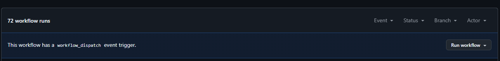

# Oppgave 6 - Introduksjon til Github Actions

## :bulb: Mål med Oppgave 6

I denne oppgaven skal vi se på hvordan vi kan knytte kjøring av jobber knyttet til koden vår. Typisk ønsker vi å trigge jobber for å sjekke at koden vår bygger/kompilerer, kjøre automatiske tester, sjekke kodekvalite, eller å kjøre jobber for å levere kode ut til et miljø. Automatiserte prosesser for å sjekke at koden er god nok, og levere koden ut kaller vi gjerne CI/CD (continuous integration og continuous deployment).

I de neste oppgavene skal vi se på continuous integration i Github Actions, der vi skal lage et oppsett for å kjøre automatiske sjekker på om koden vår er god nok til å merges inn i `main`.

__Om du starter her, initialiser et tomt repository og push dette til Github.com. Om har følgt de andre oppgavene, kan du fortsette i samme repository.__ 


# 6.1 - Oppsett av Github Action

I første del skal vi lage en enkel workflow. Målet er kun å skrive ut teksten `Hello world` hver gang en PR opprettes (eller oppdateres) mot repoet vårt.

:pencil2: Fra workshop-repoet, hent ned katalog `/code/app` inn i eget repository (behold mappestruktur). Det enkleste er å klone ned repoet og kopiere over filene. 

### Oppsett av Github Actions workflow

En workflow opprettes ved å lage en `.yaml`-fil i mappen `.github/workflows/` i repoet ditt. Den beskriver:
- Hvilke triggers som starter workflowen (`on:`)
- Hvilke jobber (`jobs:`) som skal kjøre
- Hvilke steg (`steps:`) hver jobb består av

### 6.1.1 - Opprett mappestruktur
:pencil2: Opprett mappen `.github/workflows` i roten av prosjektet

### 6.1.2 - Lag en workflow-fil
:pencil2: Opprett filen `.github/workflows/pr-hello-world.yml` med innholdet under

```yaml
name: PR Hello World

on:
  pull_request:
    types: [opened, reopened, synchronize]

jobs:
  hello:
    runs-on: ubuntu-latest
    steps:
      - name: Say hello
        run: echo "Hello world"
```

Her lager vi en workflow som heter `PR Hello World`. Under `on`-seksjonen, spesifiserer vi at workflowen skal kjøre når en PR åpnes, åpnes på nytt (etter den har vært stengt) eller når den mottar oppdateringer. 

### 6.1.3 - Commit og test
:pencil2: Legg til, commit til `main` og push filen til Github.

:pencil2: Sjekk ut en branch og utfør en vilkårlig endring. Push endring til Github og opprett en pull request.

:bulb:  Ved siden av fanen "Pull Requests" finner du fanen "Actions". Gå dit for å sjekke at workflowen din kjører. 

# 6.2 - Manuell trigger

I forrige del av oppgave 6, la vi til en automatisk trigger når en åpner pull requests. Det er også nyttig å kunne trigge actions manuelt i tilfeller der du ønsker eksplisitt kontroll over når en action kjører.

GitHub støtter dette via `workflow_dispatch` triggere. Når en workflow har denne, får du en knapp i GitHub UI (under "Actions" og inne på selve workflowen) som lar deg starte kjøringen manuelt.

### 6.2.1 - Legg til manuell trigger i eksisterende workflow
:pencil2: Åpne filen `.github/workflows/pr-hello-world.yml` og endre `on:`-seksjonen slik:

```yaml
on:
  pull_request:
    types: [opened, reopened, synchronize]
  workflow_dispatch:
```

:pencil2: Commit til `main` og push endringene til Github.com. 


:bulb: Når vi nå legger til `workflow_dispatch`, tillater vi å kjøre workflows ved å starte de manuelt. Du valg om å starte manuelt ved å gå inn på valgt workflow og trykke "Run workflow" på høyre side. 



:pencil2: Kjør workflowen manuelt for å sjekke at manuell kjøring fungerer.


---

[:arrow_right: Gå til neste oppgave](../oppgave-7/README.md)
