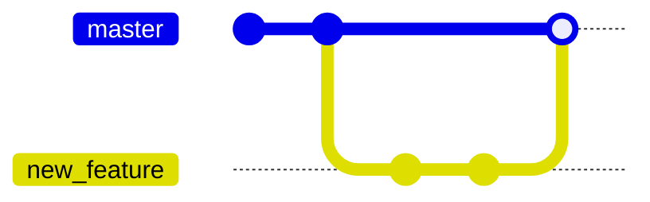
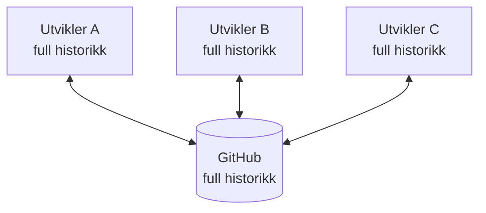
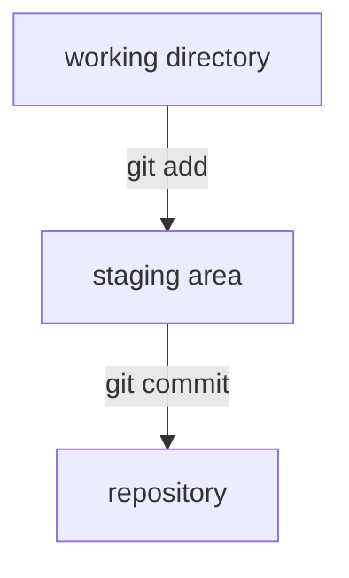
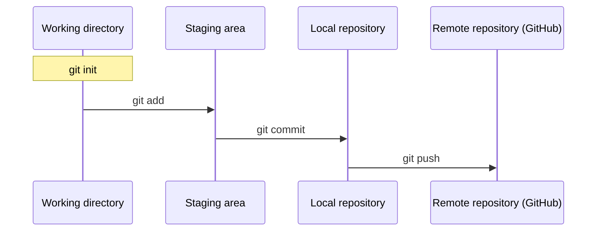
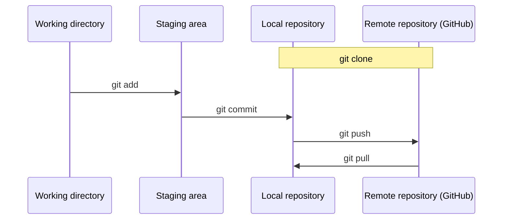

  

    
    ~/techschool — zsh
  

  

    
~/techschool (main) $ git init introduksjon-til-git

    <h1>Introduksjon til Git</h1>
    
# Ålesund TechSchool - 3. Februar 2026

  

---

# Ålesund TechSchool

- Forskjellige fagfolk fra IT-bransjen i Ålesund som ønsker å dele
- Knytte bro mellom de som skal inn i IT-bransjen og de som jobber der. Bli kjent med fremtidens kollegaer, bli kjent med arbeidsmetodikk ++
- Arena for nettverk og læring
- Representert p.t:
  - NTNU
  - Boitano
  - Reknes
  - Solwr
  - Twoday
  - Kystverket

**Discord**

---

# Agenda

- Hva er Git
- Hvordan skiller Git seg fra andre versjonskontrollsystemer
- Hvordan bruker vi Git
- Git vs Github
- Demo / eksempler

---

# Hva er Git

- System for versjonskontroll / kodeversjonering
- Sporer hvordan filer endrer seg over tid
- Ser på differanse mellom filer kontra hele filer
- Commits; hver commit peker på forrige commit. Skaper en kjede fra start til slutt. Spole frem og tilbake i tid
- Desentralisert; kan brukes både lokalt og distribuert. Synkronisere ved behov

---

# Hva er Git

---

# Hva er Git

- Sentralisert VCS (SVN)
  - Sentraliserte versjonskontrollsystemer har en kilde / server som alle brukere må jobbe mot
  - Du sjekker inn endringer rett til sentral server
  - Du må være koblet til server for å oppdatere med ditt eget arbeid
- Desentralisert VCS (Git)
  - Alle har en egen kopi av repositoriet, som også inkluderer full historikk
  - Du kan arbeide fritt lokalt, og synkronisere arbeid når du vil

---
layout: two-cols-header
---

# Desentralisert versjonskontroll

Alle har en full kopi av repositoriet, med hele historikken. GitHub er bare en felles kopi dere har blitt enige om å synkronisere mot.

::left::

**Fordeler**

- Jobb offline
- Raskt: det meste skjer lokalt
- Hver kopi er en backup
- Eksperimenter trygt i egne brancher
- Del arbeidet når du er klar

::right::

---

---

---

---

# Hvordan bruke Git

- Kommandolinjeverktøy
  - Git bash, powershell/cmd, terminal
- GUI-verktøy
  - Github Desktop
  - SourceTree
  - IDE/editor-integrasjoner (Intellij, Visual Studio Code)
- Begge deler kan brukes
  - Diffing, merging og å løse konflikter ++ løses best i et GUI-verktøy/editor
  - Kan vær effektivt med CLI-kommandoer for innsjekk og utsjekk av kode, kloning ++
  - Smak og behag. I dag skal vi bruke begge deler (CLI + VS Code)

---

# Praktisk Git

- Prøv å lage små og isolerte commits. Opprett commits med ting som hører sammen.
- Dra ofte ned endringer fra remote repository
- Synkroniser (merge) ofte endringer
- Arbeid i egen branch, gjerne der du løser et konkret problem. Integrer kode når du er ferdig i branch
- Unngå at brancher lever for lenge

---

# Git vs Github

- Git: Versjonskontrollsystem
- Github: Web-basert tjeneste / "remote repository" for kode, inkl verktøy for team-arbeid
  - Lagrer git-repositoriet ditt
  - Håndterer tilgangskontroll
  - Håndterer pull requests
  - Forks
  - Issue-tracker
  - Actions
  - Enkel hosting
  - Copilot

---

# Pull requests

- Forespørsel om å integrere kode fra en branch til en annen
- Eksempel:
  - Du jobber i et team med flere
  - Alle som vil integrere kode, må sjekke ut en branch og utføre arbeidet sitt der
  - Når feature er ferdig utvikles, opprettes en pull request - en forespørsel om å integrere kode i felles branch
  - Andre i teamet kan gå igjennom pull request og utføre en code review. Team-medlemmer kan komme med kommentarer, gi 👍 / 👎 for å kunne integrere
  - Ved 👎: Du gjør nødvendige endringer og ber om ny review.
  - Ved 👍: Du merger endringer inn i hovedbranch

---

# Pull requests

- Et viktig ledd for kvalitetssikring
- Dokumenterende. Beskrivelse i PR kan forklare hvorfor en endringer er utført
- Viktig for samarbeid. Forankring av beslutninger i team
- Kjører gjerne automatiske prosesser i PR (bygg, tester, linting, kodeanalyse)

---

# Github Issues

- Issue tracker i Github
  - Rapporterte feil
  - Feature requests
  - Tilbakemeldinger
- Nyttig å søke i når en har problemer med et åpent bibliotek
- Nyttig å legge inn issue når treffer en bug ingen har rapportert
  - Integrerer godt med Pull Requests

---
layout: center
---

# Github Demo

---
layout: center
---

<!-- TODO: legg inn skjermbilde av VS Code-demoen, f.eks.  med filen i public/ -->

# Demo i VS Code

---

# Oppgaver

- <https://github.com/Aalesund-Techschool/git>
- Når du finner: **"Velg navn selv", "Velg innhold selv".**
  Unngå kun copy-paste, men ikke tenk for komplisert. Viktigste er at du blir vant til å bygge mellom brancher, sjekke ut nye brancher etc..
- Spør om du sitter fast, eller vil diskutere
- Har du noe relevant du vil dele?
  Legg inn en melding i **#workshops** på **Discord**

<!-- TODO: skjermbildet av Source Control-panelet i VS Code (Sync Changes) lå til høyre på denne sliden -->
